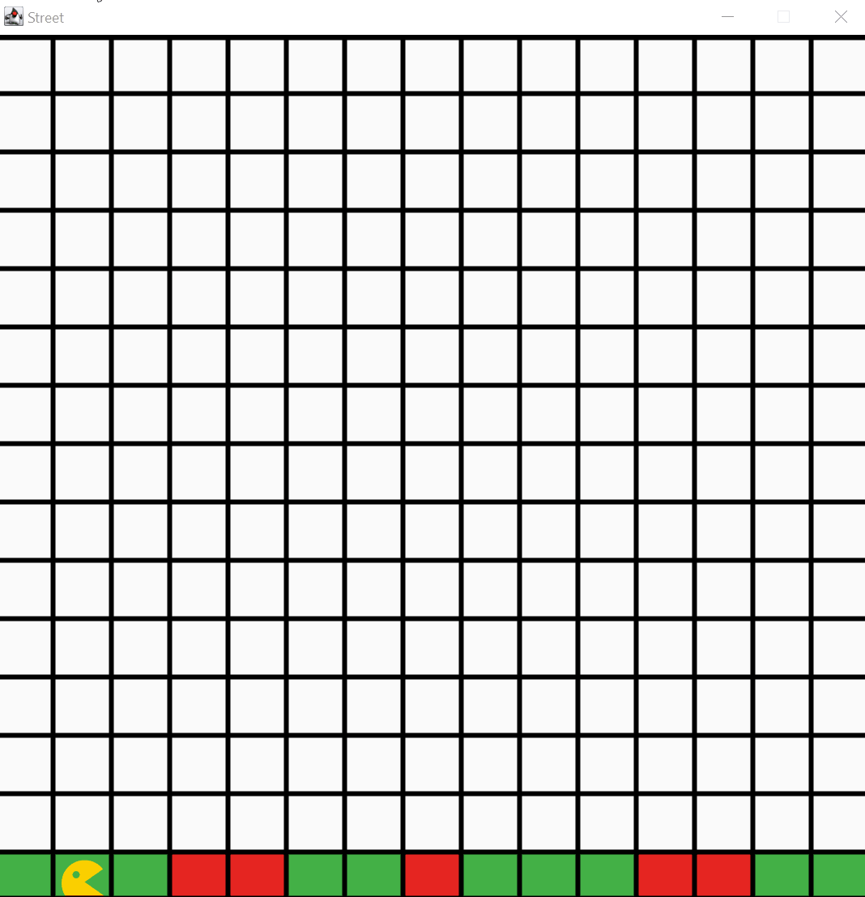

# Die Strasse

Bouncer überquert eine Straße, die aus einer Reihe grüner und roter Felder besteht. Die roten Felder markieren dabei schadhafte Stellen in der Straße, die von Bouncer durch das Ändern der Farbe (auf grün) ausgebessert werden sollen. Nach Durchlauf des Programms steht Bouncer am Ende der Straße und hat alle roten Felder grün eingefärbt. 

